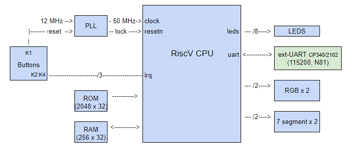
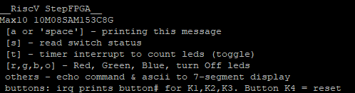

## __RiscV PicoRV on StepFPGA MAX10__

### PicoRV on StepFPGA
* Max10 FPGA 10M08SAM153C8G
* interrupts: timer & button
* basic uart with print functions
* /fw directory contains demo code
* outputs: 2x 7-segment display & 8-bit LEDs
* input: 4x switches
* UART 115200 N81 - TX connect GPIO_0 (Pin_M4), RX to GPIO_1 (Pin_P3), use external CP340 or CP2102 USB-SERIAL dongle

### Build instructions:
1. run 'make' in /fw directory to generate rom.v (need riscv32 cross compiler)
2. Synthesize, fit and assemble system with Quartus Prime (v18.1)
3. connect Uart 115200 N,8,1 
4. download to FPGA, follow 'menu' in uart - see below
5. use 'update_mif_asm.tcl' for fw changes, w/o HDL change

### Usage:
* Below options displayed on power-up:

	

	[a or 'space'] - print message

	[s] - 4 on-board switches, status is displayed

	[t] - toggle timer interrupt.  When enabled, timer will increment LED counting

	[r,g,b,o] - Red, Green, Blue, or turn Off 3-color leds

	others - other keys will have ASCII codes displayed on 7-segment display, and key will be echoed by serial port

	push-buttons K1-K3 will generate IRQ and respective number will be displayed through serial port

	K4 - reset button

### reference/resources
	StepFPGA website MAX10 info <https://www.stepfpga.com/doc/step-max10>

	
btko - Aug 2022